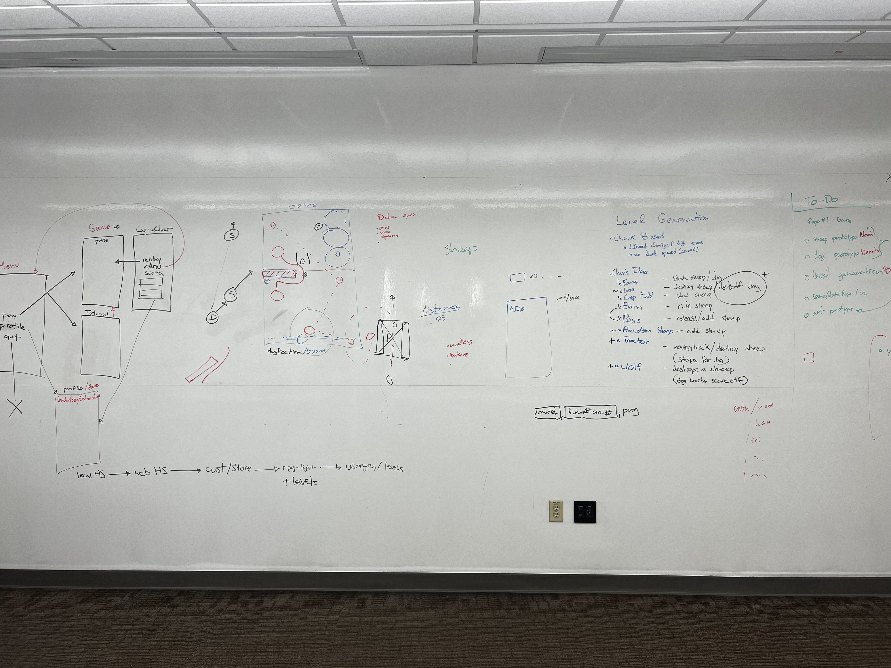

# Game Development Journal:

### Noah Olmstead Harvey, Alexander Hernandez, Ben Mann, Deandra Martin, Fritz Stapfer Paz

---
```
NOTE:  please use the following format for entries into the jornal:

### YYYYMMDD HHMM - NAME: TITLE
---
resource links
---
progress update

i STRONGLY suggest using VS code or another IDE that  
allows you to preview how your markup will render

a quick .md formatting guide is available at the link below:
```
[Quick .md Formatting Guide](#quick-md-formatting-guide)


### 20220206 1940 - Noah: A First Update

---

[Github Markdown Cheatsheet](https://github.com/adam-p/markdown-here/wiki/Markdown-Cheatsheet)

[Markdown with HTML for image resizing](https://www.xaprb.com/blog/how-to-style-images-with-markdown/)

---

Following are some images of the whiteboard after our meeting to discuss design on Sunday (2022/02/06).  *Please note, the full sized images are available in the assests folder*:

Full Board:



Scenes and Gameplay:


ToDo and Obstacles:


I have created a repo for storing our journal.  I also animated our studio name and added it to the top of the journal.  I did a little research into markdown - particularly as implemented by GitHub.  The resources in the links above came from that effort.

There is some difficulty getting images to scale appropraitely in the document.  I have decided to use the HTML method outlined in the second link to address that issue.  It can also be avoided entirely by making sure the image size in the asset folder is the same size it should appear in the document.

We will use headers in our updates, so we can link to them later in the document.  I also suggest using 24hour time so we can avoid AM/PM abiguity.


### Quick .md Formatting Guide:

```
*this is italics*
```
*this is italics*

```
**this is bold**
```
**this is bold**
```
**this is _both_**
```
**this is _both_**
```
~~this is strikethrough~~
```
~~this is strikethrough~~
```
this is `in line code`
```
this is `in line code`
```
1. this is a numbered list
1. another entry
    1. a numbered sub-list
    1. another entry
1. a final item
```
1. this is a numbered list
1. another entry
    1. a numbered sub-list
    1. another entry
1. a final item
```
- this is an unordered list
- another entry
    - this is a sub list
- a final item
```
- this is an unordered list
- another entry
    - this is a sub list
- a final item
```
[this is a link](https://www.google.com)
```
[this is a link](https://www.google.com)
```
[this is an internal link](#game-development-journal)
```
can link to any header

[this is an internal link](#game-development-journal)
```

#   simple image - from web or local directory
```

```

#   html style image - allows you to resize image
```


Additional .md formatting information can be found at the following link: