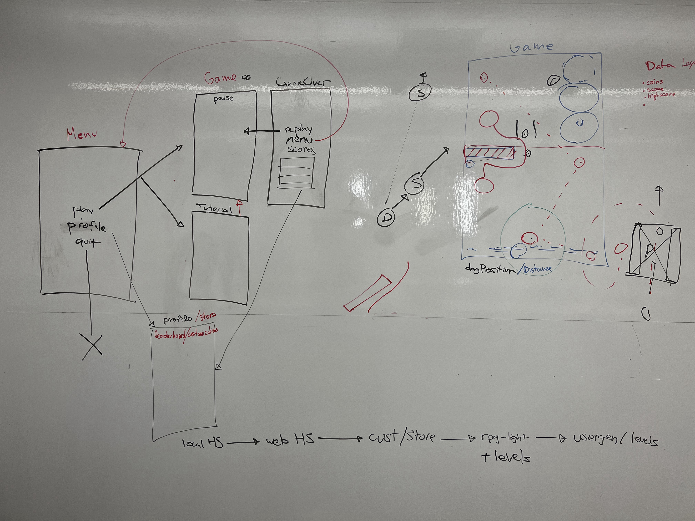
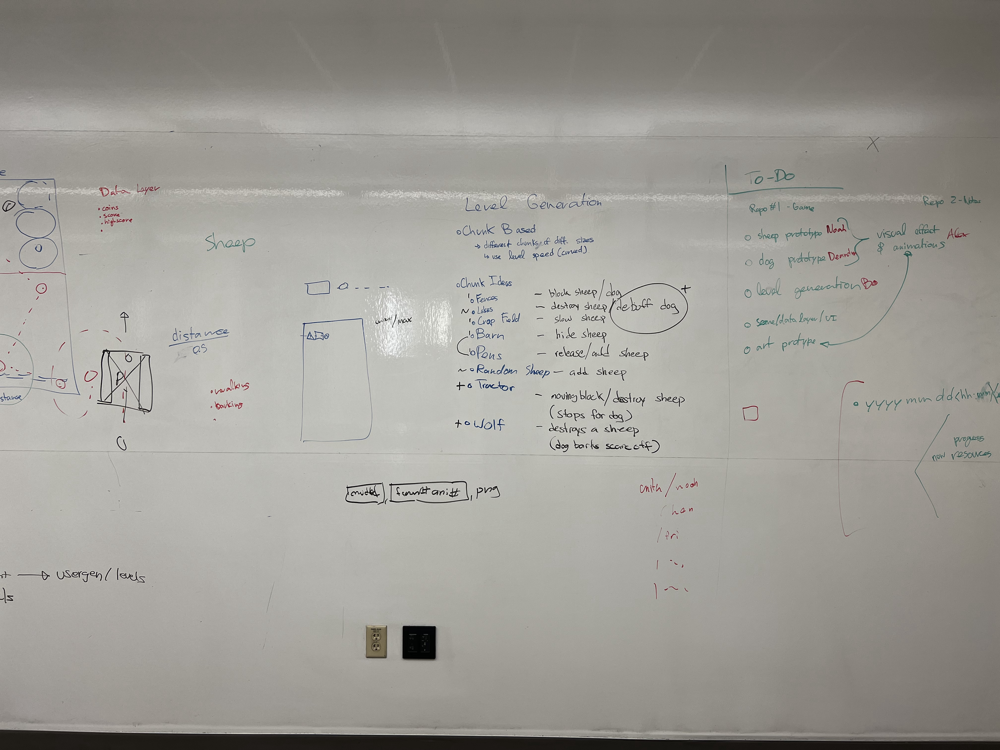

# Game Development Journal:

### Noah Olmstead Harvey, Alexander Hernandez, Ben Mann, Deandra Martin, Fritz Stapfer Paz

---
```
NOTE:  please use the following format for entries into the jornal:

### YYYY/MM/DD HH:MM - NAME: TITLE
---
resource links
---
progress update

i STRONGLY suggest using VS code or another IDE that  
allows you to preview how your markup will render

a quick .md formatting guide is available at the link below:
```
[Quick .md Formatting Guide](#quick-md-formatting-guide)

---

### Updates:
[2022/02/14 18:00 - Fritz](#20220214-1800---fritz-reading-and-studying-identified-resources)

[2022/02/10 14:00 - Fritz](#20220210-1400---fritz-finding-resources)

[2022/02/08 15:13 - Ben](#20220208-1513---ben-unity-project-journal-cloned)

[2022/02/07 13:30 - Fritz](#20220207-1330---fritz-unity-project-setup)

[2022/02/07 11:25 - Deandra](#20220207-1125---deandra-udemy-course-learning)

[2022/02/06 19:40 - Noah](#20220206-1940---noah-first-update)

---

### 2022/02/18 - Fritz: Sketching Diagrams and Exploring Requirements

I went into a room and sketched what I thought the requirements of the game could look like in the game. 


---

### 2022/02/14 18:00 - Fritz: Reading and Studying Identified Resources

I went over all the identified resources on 2022/02/10 (link) and studied how I should approach the data management design of the game. I failed to take relevant notes but absorbed a lot of material that I think will help me come up with sketches in the future. I also jotted down a list of things I thought the game would need based on the diagrams our group sketched on the whiteboard in our first meeting. 

---

### 2022/02/10 14:00 - Fritz: Finding Resources

I was told to focus my research on how to manage the scene and data management side of the game. 

I did some research on the topic, and identified a few good resources:

http://www.glenstevens.ca/unity3d-best-practices/
https://learn.unity.com/tutorial/assets-resources-and-assetbundles
https://www.youtube.com/watch?v=cPhM8wNDNng
https://www.youtube.com/watch?v=_hAzWgQupms

I did a quick read/glance over the material in the resource to determine whether it seemed useful or not but did not go through it properly as it was extensive. 

---

### 2022/02/08 15:13 - Ben: Unity Project Journal Cloned

Cloned the journal from github and unity project from github and began research on procedural generation.

---

### 2022/02/07 13:30 - Fritz: Unity Project Setup

Cleared previous Github to start from a fresh slate.

Created the Unity Project we will be doing our learning in, and setup the Unity project for Git collaboration.

Created folders within the project for each team member to be able to work in, and not have to worry too much about conflicts.

As a group, we started figuring out how to use this journal, Ben was watching attentively, Noah directing us on what to do. Hopefully git is nice to us.

---

### 2022/02/07 11:25 - Deandra: Udemy course learning 

Completed one hour of Udemy course on game development. Attempted to create a laser shooter game.


---

### 2022/02/06 19:40 - Noah: First Update


[Github Markdown Cheatsheet](https://github.com/adam-p/markdown-here/wiki/Markdown-Cheatsheet)

[Markdown with HTML for image resizing](https://www.xaprb.com/blog/how-to-style-images-with-markdown/)


Following are some images of the whiteboard after our meeting to discuss design on Sunday (2022/02/06).  *Please note, the full sized images are available in the assests folder*:

Full Board:


Scenes and Gameplay:



ToDo and Obstacles:



I have created a repo for storing our journal.  I also animated our studio name and added it to the top of the journal.  I did a little research into markdown - particularly as implemented by GitHub.  The resources in the links above came from that effort.

There is some difficulty getting images to scale appropraitely in the document.  I have decided to use the HTML method outlined in the second link to address that issue.  It can also be avoided entirely by making sure the image size in the asset folder is the same size it should appear in the document.

We will use headers in our updates, so we can link to them later in the document.  I also suggest using 24hour time so we can avoid AM/PM abiguity.


### Quick .md Formatting Guide:

```
*this is italics*
```
*this is italics*

```
**this is bold**
```
**this is bold**
```
**this is _both_**
```
**this is _both_**
```
~~this is strikethrough~~
```
~~this is strikethrough~~
```
this is `in line code`
```
this is `in line code`
```
1. this is a numbered list
1. another entry
    1. a numbered sub-list
    1. another entry
1. a final item
```
1. this is a numbered list
1. another entry
    1. a numbered sub-list
    1. another entry
1. a final item
```
- this is an unordered list
- another entry
    - this is a sub list
- a final item
```
- this is an unordered list
- another entry
    - this is a sub list
- a final item
```
[this is a link](https://www.google.com)
```
[this is a link](https://www.google.com)
```
[this is an internal link](#game-development-journal)
```
can link to any header

[this is an internal link](#game-development-journal)
```

#   simple image - from web or local directory
```

```

#   html style image - allows you to resize image
```


Additional .md formatting information can be found at the following link:

[Github Markdown Cheatsheet](https://github.com/adam-p/markdown-here/wiki/Markdown-Cheatsheet)
