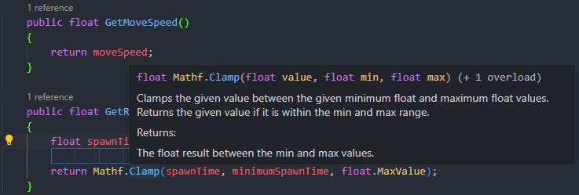

# Game Development Journal:

### Noah Olmstead Harvey, Alexander Hernandez, Ben Mann, Deandra Martin, Fritz Stapfer Paz

---
```
NOTE:  please use the following format for entries into the journal:

### YYYY/MM/DD HH:MM - NAME: TITLE
---
resource links
---
progress update

i STRONGLY suggest using VS code or another IDE that  
allows you to preview how your markup will render

a quick .md formatting guide is available at the link below:
```
[Quick .md Formatting Guide](#quick-md-formatting-guide)

---

### Updates:

[2022/03/28 20:00 - Ben](#20220328-2000---ben-implementing-new-obstacles-and-chunks)

[2022/03/28 14:00 - Fritz](#20220328-1400---fritz-implementing-new-features)

[2022/03/22 17:00 - Fritz](#20220322-1700---fritz-creating-minimum-viable-product)

[2022/03/20 13:00 - Ben](#20220320-1300---ben-cleaned-up-spawning-and-added-kill-zone)

[2022/03/14 18:00 - Ben](#20220314-1800---ben-added-chunk-spawning) 

[2022/03/10 17:00 - Ben](#20220310-1700---ben-began-added-chunk-transformation)

[2022/03/05 12:00 - Ben](#20220305-1200---ben-added-a-chunk-instantiation-system)

[2022/03/01 15:00 - Ben](#20220301-1500---ben-began-implementing-chunk-systems) 

[2022/02/22 14:00 - Ben](#20222222-200---ben-finishing-research-on-tiles)

[2022/02/22 10:00 - Fritz](#20220222-1000---fritz-digital-concept-diagrams)

[2022/02/22 13:10 - Ben](#20222022-110---ben-created-chunk-concept-diagram)

[2022/02/21 22:00 -Noah](#20220221-2200---noah-messing-around-with-herder-projectprototype)

[2022/02/19 15:34 - Deandra](#20220219-1534---deandra-dog-graphics-and-visual-effects)

[2022/02/18 19:00 - Alex](#20220218-1900---alex-udemy-course-part-2)

[2022/02/18 14:00 - Fritz](#20220218-1400---fritz-sketching-diagrams-and-exploring-requirements)

[2022/02/17 19:00 - Alex](#20220217-1900---alex-udemy-course-part-1)

[2022/02/16 20:00 - Noah](#20220216-2000---noah-more-work-on-udemy-course)

[2022/02/16 19:00 - Alex](#20220216-1900---alex-animation-timeline)

[2022/02/15 23:57 - Ben](#20220215-1157---ben-researched-chunk-spawning-and-event-tracking)

[2022/02/15 21:19 - Deandra](#20220215-2119---deandra-audiotrigger-for-dog-barking)

[2022/02/15 9:00 - Alex](#20220215---alex-unity-setup-and-exploration)

[2022/02/14 18:00 - Fritz](#20220214-1800---fritz-reading-and-studying-identified-resources)

[2022/02/12 11:22 - Ben](#20220212-1122---ben-began-working-with-strata-for-procedural-generation)

[2022/02/11 18:30 - Noah](#20220211-1830---noah-vs-code-intellisense-fix)

[2022/02/11 13:30 - Deandra](#20220211-1330---deandra-touch-controls-for-dog-movement)

[2022/02/10 14:00 - Fritz](#20220210-1400---fritz-finding-resources)

[2022/02/10 9:23 - Ben](#20220210-923---ben-udemy-course-learning)

[2022/02/08 20:00 - Noah](#20220208-2000---noah-started-udemy-course)

[2022/02/08 15:13 - Ben](#20220208-1513---ben-unity-project-journal-cloned)

[2022/02/08 11:08 - Deandra](#20220208-1108---deandra-c-basics)

[2022/02/07 13:30 - Fritz](#20220207-1330---fritz-unity-project-setup)

[2022/02/07 11:25 - Deandra](#20220207-1125---deandra-udemy-course-learning)

[2022/02/06 19:40 - Noah](#20220206-1940---noah-first-update)

---
### 2022/03/28 20:00 - Ben: Implementing New Obstacles and Chunks

    Added a Lake and Barn.

    The Lake destroys the sheep on collision and fades the sheep out of the scene.

    Barn instantiates new sheep to be spawned and the barn fades out of the scene.

    Created new chunks 3-10

---

### 2022/03/28 14:00 - Fritz: Implementing New Features

In class, I fixed bugs and added features:

* Added score reset when playing the game again
* Fixed canvas scaling so that it would look consistent across all devices
* Added score and highscore text to end scene
* Modified sheep to rotate towards where they are moving
* Modified dog to rotate toward user's click
* Modified visibility of chunk's parent variable
* Helped Ben with commenting his lake's code, and did a few tweaks to the feature he introduced to see if it improved feeling of gameplay

---

### 2022/03/22 17:00 - Fritz: Creating Minimum Viable Product

Integrated all of the parts for the game.

I made sure we had a minimum viable product (used for Sprint 3 Demo). 

I used Ben's level/terrain generation, modified it, and made it work with the other pieces. Also used some of Alex's sheep code for the sheep to work, while make sure it worked with all the rest. 

Then I developed the dog, and ensured everything worked smoothly with the data and scene layers. Created gameover condition, checked important data was being tracked, etc.

Created first build, worked on Sprint 3 document with Ben, and submitted project.

--- 
### 2022/03/20 13:00 - Ben: Cleaned up Spawning and Added Kill Zone

    Cleaned up the spawning system to be less complicated

    Added kill zone to destroy chunks when they leave the screen

    Cleaned up chunk scaling to fit on new screen

  ---   

### 2022/03/14 18:00 - Ben: Added Chunk Spawning

    Created a script to Instantiate a list of Chunks.

    The Chunks must contain a script called Chunk to considered a chunk for the list.

    Chunks have a size for how long until the next chunk will be spawned after the current chunk spawned.

--- 

### 2022/03/10 17:00 - Ben: Began Added Chunk Transformation

    Used rigidbody to transform chunks down the scene.

    Intially they had gravity but then that was switched off.

    Need to add Spawning System and Kill Zone.

--- 
### 2022/03/05 12:00 - Ben: Added a Chunk Instantiation System

    Used Strata as a base to develop a Chunk Instantiation System.

--- 

### 2022/03/01 15:00 - Ben: Began Implementing Chunk Systems

    I created 2 test chunks only using fences and coliders.

    In order to test the interactions between the dog and the fence.

    I determined there was a gap in one of the coliders and that had to be fixed for later.

--- 
### 2022/02/22 14:00 - Ben: Finishing Research on Tiles

Resources: 

 - [https://www.youtube.com/watch?v=6Y0U8GHiuBA](https://www.youtube.com/watch?v=6Y0U8GHiuBA)

 - [https://www.youtube.com/watch?v=CGleQZVgdN4&list=PLBIb_auVtBwCKQk6blxNPYC5GEuaC4DGm&index=1](https://www.youtube.com/watch?v=CGleQZVgdN4&list=PLBIb_auVtBwCKQk6blxNPYC5GEuaC4DGm&index=1) (Playlist linked for Tutorials on Game development for Mobile with Unity)


I finished up my research on using tiles and tile managing.

I primarily used a video on generating infinite tiles which will be useful for our game this video was in 3D.

It will have to be converted to 2.5-2D for our purposes.

The obstacles in the game will have colliders, padding, and various interactions with the dog and sheep.

Did Additional Research on developing mobile apps in Unity and testing of them.

---

### 2022/02/22 10:00 - Fritz: Digital Concept Diagrams

I came up with the following concept diagram to try modelling a possible schema of how we will be organizing our data within the game, and how this layer will communicate with different components of the game. 


I also explored and messed around with Serialization, and came up with some codes on how we might be able to use Binary Serialization instead of Unity’s PlayerPrefs to store data of different types in a more efficient, and secure manner. 

---

### 2022/02/22 13:10 - Ben: Created Chunk Concept Diagram

Created the Following Chunk Concept Diagram.


Sketched gameplay and ways of deleting based on research.

Created Using LucidChart.

---

### 2022/02/21 22:00 - Noah: Messing Around With Herder Project/Prototype

After pulling the latest copy of the Herder project from git and launching it through Unity Hub, I got an error message "This project was last saved with editor version: 2020.3.27f1".  I continued and I don't think there were any issues, but we probably need to be more careful with what version of the editor we are using once we start the project.  The project booted into "safemode" because there were errors in a script.  After fixing the error (missing `;`), I loaded into the project proper and began creating "dog" and "sheep" prefabs.


Still need to add play/dog movement (similar to laserDefender) and update sheep position/rotation based on that.

---

### 2022/02/19 15:34 - Deandra: Dog graphics and visual effects

Resource:

 - [Unity sprites documentation](https://docs.unity3d.com/2021.1/Documentation/Manual/Sprites.html)

Our group hasn't decided on whether we're using low poly or high poly graphics. I have been doing research using unity documentation on how to create custom sprites for a player (dog in this case). I haven't attempted testing this out yet, but will be coming back to it.

---

### 2022/02/18 19:00 - Alex: Udemy Course Part 2

I spent another 30 min on the project doing the next 3 videos of the Udemy course which were instantiating enemies, coroutines, and while loops. Again, just trying to learn the system before going straight to my task. Its going smoothly as of right now. It takes you step by steps in the videos but don’t feel super comfortable with the information.

---

### 2022/02/18 14:00 - Fritz: Sketching Diagrams and Exploring Requirements

I went into a room and sketched what I thought the requirements of the game could look like in the game. 


---

### 2022/02/17 19:00 - Alex: Udemy Course Part 1

I spent about 30 min again on our project. I continued the Udemy course on the laser defender. The videos I watched today was the boundaries, enemies, and pathfinding. I’m just trying to learn the basics of Unity before trying to focus on my specific task after yesterday seeing animations can go in-depth.

---

### 2022/02/16 20:00 - Noah: More Work on Udemy Course

Continued udemy course:
 - Created screen boundaries with padding (to avoid player leaving/clipping off screen)
 - Created two paths for enemy pathfinding
 - Created two waves composed of a path and enemies
 - Created scripts to handle spawning enemy waves

At this point, I ran into an issue.  When I ran the game, two waves would spawn, but they would both be the same wave (same path/enemies).  I spent 15min looking through all the prefabs used to spawn the enemy waves, but as far as I could tell, everything was wired up correctly.


After a short break (and thinking about it more), I realized the for loop in the enemy spawner script was not updating the current wave.


After adding that line of code to update the wave, the game plays correctly


---

### 2022/02/16 19:00 - Alex: Animation Timeline

Today I only spent about 30 minutes continuing my exploration of Unity. Today I focused more on the task I was given into the group which was Art Animations/ Polishing up. I found a video on YouTube that has of Animation basics in Unity. I was only able to get through the first video and get a true grasp of what he was explaining. This was more of timeline animation then actual programming animations. 

https://www.youtube.com/watch?v=hPVSaG7jT5I

---

### 2022/02/15 23:57 - Ben: Researched Chunk Spawning and Event Tracking

Resources:

 - [https://www.youtube.com/watch?v=FjD_DwbYYcs](https://www.youtube.com/watch?v=FjD_DwbYYcs)

 - [https://www.youtube.com/watch?v=-2Rwsc0COqQ](https://www.youtube.com/watch?v=-2Rwsc0COqQ)

Used Matt MirrorFish's video to do some researching on tracking spawning of chunks.
Began experimenting with the program myself in unity, watching the level be endlessly generator with the track.

Conclusion, Tracking of events, and destroying checks will be useful for the mobile app.

---
### 2022/02/15 21:19 - Deandra: Audio/trigger for dog barking

In the Udemy course, there is a specific video on sound effects. The scripting used could be adapted to have the player (dog) bark at a specific time (will have to iron out the details with my team later). Import barking audio asset from the unity asset store?


---

### 2022/02/15 9:00 - Alex: Unity Setup and Exploration

I spent about 40 min around the Unity program trying out different scenes, seeing what the program can do. I am also started in a section in Udemy creating a Laser Defender. I only got to finish up to the Unity Input System today.

https://www.udemy.com/course/unitycourse/learn/lecture/28711402#overview

---

### 2022/02/14 18:00 - Fritz: Reading and Studying Identified Resources

I went over all the identified resources on 2022/02/10 (link) and studied how I should approach the data management design of the game. I failed to take relevant notes but absorbed a lot of material that I think will help me come up with sketches in the future. I also jotted down a list of things I thought the game would need based on the diagrams our group sketched on the whiteboard in our first meeting. 

---

### 2022/02/12 11:22 - Ben: Began Working with Strata for Procedural Generation

Resources: 

 - [https://www.gamedeveloper.com/design/2d-procedural-generation-in-unity-with-scriptableobjects](https://www.gamedeveloper.com/design/2d-procedural-generation-in-unity-with-scriptableobjects)

Started trying to use strata to develop procedural levels, used this for roguelike duegueon development.

Used strata create various chunks of arrays to be used to generate additional chunks.

Coded a Test Environment for the Chunks, and created a test tile map.

Determined this might not be the best option for our purposes of Developing a mobile app.

---

### 2022/02/11 18:30 - Noah: VS Code IntelliSense Fix

Resources:
 - [VS Code: Unity Development documentation page](https://code.visualstudio.com/docs/other/unity)
 - [.NET Core SDK](https://dotnet.microsoft.com/en-us/download)
 - [.NET Framework Developer Pack](https://dotnet.microsoft.com/en-us/download/dotnet-framework/net471)
 - [stackoverflow question](https://stackoverflow.com/questions/59823422/vs-code-intellisense-not-working-for-unity3d)

When I was working on the player movement script for the udemdy course I noticed that IntelliSense (the feature that allows tab-completion, and gives you information on parameters) wasn't working.  After searching I found this [VS Code: Unity Development documentation page](https://code.visualstudio.com/docs/other/unity).  Per that documentation, I installed the [.NET Core SDK](https://dotnet.microsoft.com/en-us/download), and following the "Enabling code completion (For recent versions of Unity)" section, I also installed the [.NET Framework Developer Pack](https://dotnet.microsoft.com/en-us/download/dotnet-framework/net471).  After restarting my computer and reloading the project, Intellisense still didn't seem to be working.  More searching led me to this [stackoverflow question](https://stackoverflow.com/questions/59823422/vs-code-intellisense-not-working-for-unity3d) - the top answer pointed out the (Edit > Preferences > External Tools) menu.  In that window, I changed the "External Script Editor" to Visual Studio Code, selected all the boxes under "Generate .csproj files for:", and selected "Regenerate project files".


After that fix IntelliSense seemed to be back up and running!

*NOTE:  While Intellisense is not strictly speaking necessary for Unity development, it is invaluable to the learning process - particularly with unfamiliar languages/libraries.  Further, it is confidence inspiring to see that fresh code you're writing "makes sense" without needing to repeatedly check documentation.*


*Tab-Complete*



*Parameter Info*

---

### 2022/02/11 13:30 - Deandra: Touch controls for dog movement

Resources:

 - [Touch Controls in Unity video](https://www.youtube.com/watch?v=bp2PiFC9sSs)
 - [Touch & Go video](https://www.youtube.com/watch?v=Cw6B-VYNba0)

I watched these youtube videos to help me understand how touch controls work in Unity. I found the resource to be extremely helpful to begin a dog prototype as they covered how to implement different movements for a 2D player. The video covered using a joystick to help the player move around, which I think would be an awesome idea but would need to consult with my team members to see if they like the idea.

---

### 2022/02/10 14:00 - Fritz: Finding Resources

I was told to focus my research on how to manage the scene and data management side of the game. 

I did some research on the topic, and identified a few good resources:

 - [http://www.glenstevens.ca/unity3d-best-practices/](http://www.glenstevens.ca/unity3d-best-practices/)
 - [https://learn.unity.com/tutorial/assets-resources-and-assetbundles](https://learn.unity.com/tutorial/assets-resources-and-assetbundles)
 - [https://www.youtube.com/watch?v=cPhM8wNDNng](https://www.youtube.com/watch?v=cPhM8wNDNng)
 - [https://www.youtube.com/watch?v=_hAzWgQupms](https://www.youtube.com/watch?v=_hAzWgQupms)

I did a quick read/glance over the material in the resource to determine whether it seemed useful or not but did not go through it properly as it was extensive. 

---

### 2022/02/10 9:23 - Ben: Udemy Course Learning

Watched 2 hours of video to familiarize myself with Unity using the Udemy Laser Shooter Game as a platform.

---

### 2022/02/08 20:00 - Noah: Started Udemy Course

Began the udemy course:
 - Imported assets and installed needed packages
 - Created player and enemy objects
 - Wrote script to handle player movement

 *ISSUE: VS Code IntelliSense not working for Unity Libraries*

---

### 2022/02/08 15:13 - Ben: Unity Project Journal Cloned

Cloned the journal from github and unity project from github and began research on procedural generation.

---

### 2022/02/08 11:08 - Deandra: C# basics

I was a bit lost with C# scripting in the Udemy course videos so I had to familiarize myself with C# basics [not sure how long it took; maybe an hour or so?] using Code academy which was suggested by Ben in an earlier meeting. 

---

### 2022/02/07 13:30 - Fritz: Unity Project Setup

Cleared previous Github to start from a fresh slate.

Created the Unity Project we will be doing our learning in, and setup the Unity project for Git collaboration.

Created folders within the project for each team member to be able to work in, and not have to worry too much about conflicts.

As a group, we started figuring out how to use this journal, Ben was watching attentively, Noah directing us on what to do. Hopefully git is nice to us.

---

### 2022/02/07 11:25 - Deandra: Udemy course learning 

Completed one hour of Udemy course on game development. Attempted to create a laser shooter game.


---

### 2022/02/06 19:40 - Noah: First Update

Resources:

 - [Github Markdown Cheatsheet](https://github.com/adam-p/markdown-here/wiki/Markdown-Cheatsheet)
 - [Markdown with HTML for image resizing](https://www.xaprb.com/blog/how-to-style-images-with-markdown/)


Following are some images of the whiteboard after our meeting to discuss design on Sunday (2022/02/06).  *Please note, the full sized images are available in the assets folder*:

Full Board:


Scenes and Gameplay:


ToDo and Obstacles:


I have created a repo for storing our journal.  I also animated our studio name and added it to the top of the journal.  I did a little research into markdown - particularly as implemented by GitHub.  The resources in the links above came from that effort.

There is some difficulty getting images to scale appropriately in the document.  I have decided to use the HTML method outlined in the second link to address that issue.  It can also be avoided entirely by making sure the image size in the asset folder is the same size it should appear in the document.

We will use headers in our updates, so we can link to them later in the document.  I also suggest using 24hour time so we can avoid AM/PM ambiguity.


### Quick .md Formatting Guide:

```
*this is italics*
```
*this is italics*

```
**this is bold**
```
**this is bold**
```
**this is _both_**
```
**this is _both_**
```
~~this is strikethrough~~
```
~~this is strikethrough~~
```
this is `in line code`
```
this is `in line code`
```
1. this is a numbered list
1. another entry
    1. a numbered sub-list
    1. another entry
1. a final item
```
1. this is a numbered list
1. another entry
    1. a numbered sub-list
    1. another entry
1. a final item
```
- this is an unordered list
- another entry
    - this is a sub list
- a final item
```
- this is an unordered list
- another entry
    - this is a sub list
- a final item
```
[this is a link](https://www.google.com)
```
[this is a link](https://www.google.com)
```
[this is an internal link](#game-development-journal)
```
can link to any header

[this is an internal link](#game-development-journal)
```

#   simple image - from web or local directory
```

```

#   html style image - allows you to resize image
```


Additional .md formatting information can be found at the following link:

[Github Markdown Cheatsheet](https://github.com/adam-p/markdown-here/wiki/Markdown-Cheatsheet)
